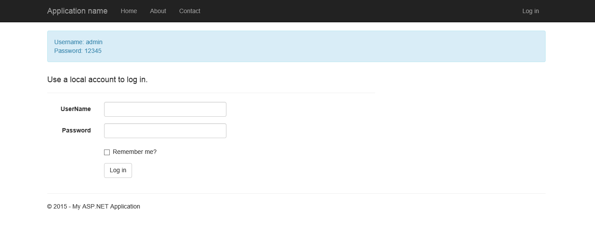

SVAuth integration with OWIN using ASP.NET MVC 5
=====

### Description

This is a simple SVAuth integration with OWIN using ASP.NET MVC 5.
User profile information is assumed to be provided by SVAuth via Session variables.

### Screenshot

### License
- [MIT](http://opensource.org/licenses/MIT)
